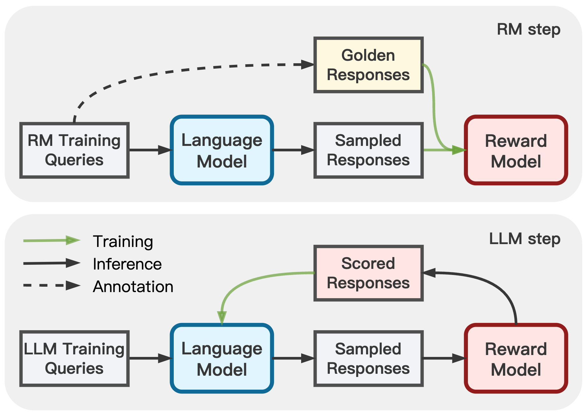

# Adversarial Preference Optimization

[](https://github.com/Linear95/APO/blob/main/LICENSE)
[](https://github.com/Linear95/APO/blob/main/DATA_LICENSE)
[](https://www.python.org/downloads/release/python-380/)

This repo contains the implementation of the ACL 2024 paper:
- [Adversarial Preference Optimization: Enhancing Your Alignment via RM-LLM Game](https://arxiv.org/abs/2311.08045). 

In Adversarial Preference Optimization (APO), we let the reward model (RM) and LLM agent play a min-max game, through which both models can be further enhanced without additional preference annotation.

<p align="center">
  
</p>

For an overview, the repo contains:
- [Split Helpful\&Harmless](https://drive.google.com/drive/folders/1v0xNMMOfL9lfFLzTGCerZCPNPJrR9ZLX?usp=sharing) (HH) dataset
- [GPT-4 responses](https://drive.google.com/file/d/1hDo6Sk8QX1c3kP_qJUgZ4J16kHAi0hEq/view?usp=sharing) as golden annotation on HH-RM training set
- The base RM, testing RM, and APO RM training \& scoring pipelines
- The LLM response generation [pipeline](https://github.com/Linear95/APO/blob/main/tools/llm_response_gen.sh)


## Environment
We use `Python3.8` with the dependencies listed in `requirements.txt`. To build the appropriate environment, use the following command:
```
pip3 install -r requirements.txt
```

## Data \& Annotation

To separately update RM and LLM, we split the cleaned [Helpful\&Harmless](https://github.com/Linear95/DSP/tree/main/data) (HH) dataset into an RM training set and a LLM training set.
| Data Type| HH-RM Train Set | HH-LLM Train Set| HH Test Set|
| --------:| :----------|:-------| :--------|
| Preference Pairs | [RM training set](https://drive.google.com/file/d/12DefElb3DazIPeaIEwd0B_9La84Slc7f/view?usp=sharing) | [RM validation set](https://drive.google.com/file/d/1ZqTuupFxrK2m3_E6ezMRcdT_4k6zX-IW/view?usp=sharing) (sampled 10K pairs) | [RM testing set](https://drive.google.com/file/d/1ite1KXZlGs1ojCVB20rLHlj7_3KlOULY/view?usp=sharing)|
| Golden Answers | [APO positive responses](https://drive.google.com/file/d/1hDo6Sk8QX1c3kP_qJUgZ4J16kHAi0hEq/view?usp=sharing) |  | |
| LLM Samples | APO negative responses ([`alpaca_rm_samples`](https://drive.google.com/file/d/1_wiKVKob6QVOHja4C_N-y5LlvHZE9ZiZ/view?usp=sharing)) | LLM alignment samples ([`alpaca_llm_samples`](https://drive.google.com/file/d/1ZpAXK0F-YC919_vP7gnyGpo8ezQGIv5O/view?usp=sharing))| [LLM testing Queries](https://drive.google.com/file/d/1ite1KXZlGs1ojCVB20rLHlj7_3KlOULY/view?usp=drive_link)|


On both HH-RM and HH-LLM training sets, we infer four LLM responses for each query as [`alpaca_rm_samples`](https://drive.google.com/file/d/1_wiKVKob6QVOHja4C_N-y5LlvHZE9ZiZ/view?usp=sharing) and [`alpaca_llm_samples`](https://drive.google.com/file/d/1ZpAXK0F-YC919_vP7gnyGpo8ezQGIv5O/view?usp=sharing). `alpaca_rm_samples` is combined with the golden responses on the HH-RM set as APO RM training pairs. `alpaca_llm_samples` is further scored by RMs and used for LLM alignment. To obtain LLM responses by yourself, run the command:
```bash
bash tools/llm_response_gen.sh
```


## RM Training

### Base RM Training

We build our RM on the pretrained LLaMA-7B ([`decapoda-research/llama-7b-hf`](https://huggingface.co/decapoda-research/llama-7b-hf)). To train the base RM for rejection sampling, use the following command:

```bash
REPO_DIR=<path_to_this_repo>
DATA_DIR=${REPO_DIR}/data/hh-split
TRAIN_DATA_LIST="${DATA_DIR}/rm_data/hh_split_rm.train.json"
TEST_DATA_LIST="${DATA_DIR}/eval_data/hh_cleaned_origin.test.json\
		${DATA_DIR}/eval_data/hh_split_llm.valid.json"
		
NUM_GPUS=8
BATCH_SIZE=64
MICRO_BATCH_SIZE=1
LEARNING_RATE=1e-6
GRADIENT_ACCUMULATION_STEP=$((BATCH_SIZE / NUM_GPUS / MICRO_BATCH_SIZE))

torchrun --nproc_per_node=${NUM_GPUS} --master_port=6000 ${REPO_DIR}/train.py \
    --task_type hh_split \
    --do_train True \
    --eval_at_start False \
    --model_type reward \
    --model_name_or_path "decapoda-research/llama-7b-hf" \
    --data_type "comparison_pair" \
    --train_data_path ${TRAIN_DATA_LIST} \
    --eval_data_path ${TEST_DATA_LIST} \
    --rm_calibration True \
    --data_suffix rm_base \
    --add_sep_token True \
    --remove_unused_columns false \
    --output_dir <path_to_save_your_RM_checkpoint> \
    --num_train_epochs 1 \
    --per_device_train_batch_size ${MICRO_BATCH_SIZE} \
    --per_device_eval_batch_size ${MICRO_BATCH_SIZE} \
    --gradient_accumulation_steps ${GRADIENT_ACCUMULATION_STEP} \
    --evaluation_strategy steps \
    --padding_side right \
    --truncation_side left \
    --pooling_type last \
    --max_length 512 \
    --save_strategy steps \
    --learning_rate ${LEARNING_RATE} \
    --warmup_steps 100 \
    --deepspeed configs/default_offload_opt_param.json \
    --tf32 false --fp16 false
```

We also trained a testing RM to automatically evaluate the LLM response quality on the testing queries. To train the testing RM, change `TRAIN_DATA_LIST=${DATA_DIR}/hh_cleaned_origin.train.json` in the above command to learn with all the HH training comparisons.

The RM training data files (values in `TRAIN_DATA_LIST`) are lists of dictionaries, where each dictionary is an RM training item (`--data_type="comparison_pair"`) including the following keys:
- `text`: a list of query-response text, split by a special token `<sep>`.
- `scores`: a list of float numbers, representing the preference scores of the corresponding query-response text.
- `query_id`: a unique ID to the RM training item.


### APO RM Training

To train the APO RM, first merge LLM samples and golden annotations into APO comparison pairs:
```
REPO_DIR=<path_to_this_repo>
DATA_DIR="${REPO_DIR}/data/hh-split"

python3 ${REPO_DIR}/tools/apo_data_converter.py \
	--golden_data_path ${DATA_DIR}/rm_data/hh_split_rm.golden.json \
	--sample_data_path ${DATA_DIR}/rm_data/hh_split_rm_alpaca_v0.sample.json \
	--output_dir ${DATA_DIR}/apo_data \
	--apo_data_name "rm_apo_data_v0"
```

Then use the following command to conduct APO RM finetuning:
```
REPO_DIR=<path_to_this_repo>
DATA_DIR=${REPO_DIR}/data/hh-split
TRAIN_DATA_LIST="${DATA_DIR}/rm_data/hh_split_rm.train.json \
		 ${DATA_DIR}/apo_data/rm_apo_data_v0_text_scores.json"
NUM_APO_SAMPLES=4

TEST_DATA_LIST="${DATA_DIR}/eval_data/hh_cleaned_origin.test.json \
		${DATA_DIR}/eval_data/hh_split_llm.valid.json"
		
NUM_GPUS=8
BATCH_SIZE=64
MICRO_BATCH_SIZE=1
LEARNING_RATE=1e-6
APO_COEFF=0.1
GRADIENT_ACCUMULATION_STEP=$((BATCH_SIZE / NUM_GPUS / MICRO_BATCH_SIZE))


torchrun --nproc_per_node=${NUM_GPUS} --master_port=6000 ${REPO_DIR}/train.py \
    --task_type apo \
    --do_train True \
    --eval_at_start False \
    --model_type reward \
    --model_name_or_path "decapoda-research/llama-7b-hf" \
    --data_type "comparison_pair" \
    --train_data_path ${TRAIN_DATA_LIST} \
    --eval_data_path ${TEST_DATA_LIST} \
    --rm_calibration True \
    --data_suffix rm_apo_v1 \
    --add_sep_token True \
    --remove_unused_columns false \
    --output_dir <path_to_save_your_APO_RM_checkpoint> \
    --num_train_epochs 1 \
    --apo_loss_coeff ${APO_COEFF} \
    --apo_sample_num ${NUM_APO_SAMPLES} \
    --per_device_train_batch_size ${MICRO_BATCH_SIZE} \
    --per_device_eval_batch_size ${MICRO_BATCH_SIZE} \
    --gradient_accumulation_steps ${GRADIENT_ACCUMULATION_STEP} \
    --evaluation_strategy steps \
    --padding_side right \
    --truncation_side left \
    --pooling_type last \
    --max_length 512 \
    --save_strategy steps \
    --save_total_limit 10 \
    --learning_rate ${LEARNING_RATE} \
    --warmup_steps 100 \
    --deepspeed configs/default_offload_opt_param.json \
    --tf32 false --fp16 false
```
## RM Scoring

After finishing the RM training, we can use the following command to scoring new LLM samples:
```bash
REPO_DIR=<path_to_this_repo>
DATA_DIR=${REPO_DIR}/data/hh-split/llm_data
DATA_PATH="${DATA_DIR}/hh_split_llm_alpaca_v0.sample.json"

MODEL_PATH=<path_to_your_RM_checkpoint>
MODEL_NAME="base_rm" # or "apo_rm"

NUM_GPUS=8
MICRO_BATCH_SIZE=16

torchrun --nproc_per_node=${NUM_GPUS} --master_port=6000 ${REPO_DIR}/train.py \
    --task_type inference \
    --do_train False \
    --eval_at_start True \
    --model_type reward \
    --model_name_or_path ${MODEL_PATH} \
    --data_type "reject_sample" \
    --eval_data_path ${DATA_PATH} \
    --rm_calibration False \
    --data_suffix ${MODEL_NAME} \
    --add_sep_token True \
    --remove_unused_columns false \
    --output_dir <path_to_save_your_inference_results> \
    --per_device_eval_batch_size ${MICRO_BATCH_SIZE} \
    --evaluation_strategy steps \
    --padding_side right \
    --truncation_side left \
    --pooling_type last \
    --max_length 512 \
    --deepspeed configs/default_offload_opt_param.json \
    --tf32 false --fp16 false


# rejection sampling
SCORE_PATH=${DATA_PATH}_pred_${MODEL_NAME}_results.json
OUTPUT_FILE_NAME=${DATA_PATH}_rjs_${MODEL_NAME}.json

python3 ${REPO_DIR}/tools/rejection_sampling.py \
	--data_path ${DATA_DIR} \
	--score_path ${SCORE_PATH} \
	--output_dir ${DATA_DIR} \
	--rm_scorer  ${MODEL_NAME} \
	--output_file_name ${OUTPUT_FILE_NAME}

# remove tmp inference files
rm ${DATA_DIR}/*rank*.jsonl
```
After inference process, we obtain a RM scoring file `${DATA_PATH}_rjs_${MODEL_NAME}.json`. Then we can update the Alpaca model with the training pipeline [here](https://github.com/tatsu-lab/stanford_alpaca).


## Citation
```
@inproceedings{cheng2024adversarial,
  title={Adversarial Preference Optimization: Enhancing Your Alignment via RM-LLM Game},
  author={Cheng, Pengyu and Yang, Yifan and Li, Jian and Dai, Yong and Hu, Tianhao and Cao, Peixin and Du, Nan and Li, Xiaolong},
  booktitle={Findings of the Association for Computational Linguistics},
  year={2024}
}
```
