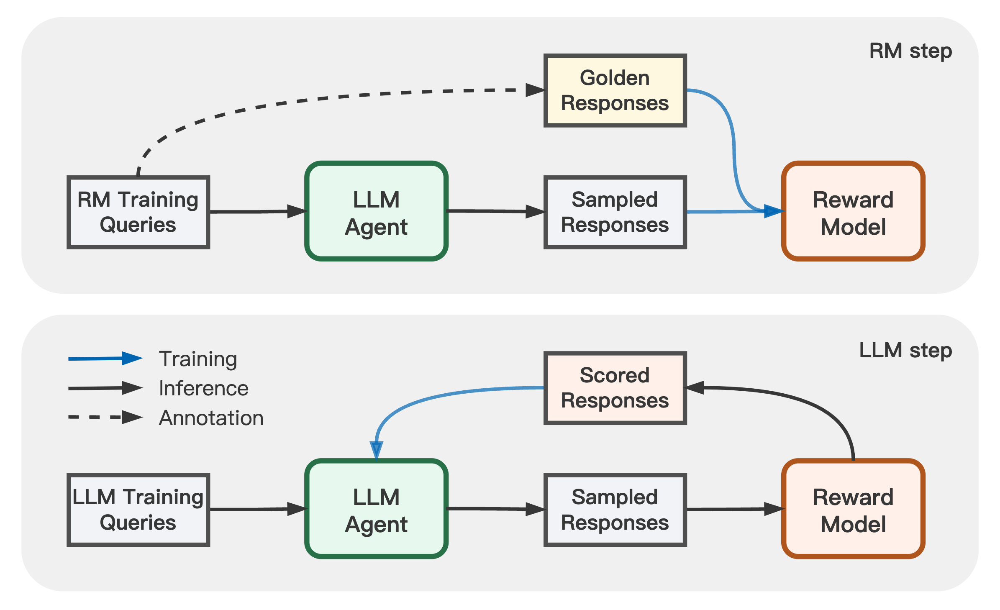

# Adversarial Preference Optimization

[](https://github.com/Linear95/APO/blob/main/LICENSE)
[](https://github.com/Linear95/APO/blob/main/DATA_LICENSE)
[](https://www.python.org/downloads/release/python-380/)

This repo contains the implementation of [Adversarial Preference Optimization](https://arxiv.org/abs/2311.08045) (APO). 

We let the reward model (RM) and LLM agent play a min-max game, through which both models can be further enhanced without additional preference annotation.

<p align="center">
  
</p>

Currently, the repo contains:
- [Split Helpful\&Harmless](data/hh-split) (HH) dataset
- [GPT-4 responses](data/hh-split/rm_data/hh_split_rm.golden.json) as golden annotation on HH-RM training set
- The Base & Testing RM training pipeline

We are continuously updating this repo for the reproduction of APO experiments.

## Data \& Annotation

To separately update RM and LLM, we split the cleaned [Helpful\&Harmless](https://github.com/Linear95/DSP/tree/main/data) (HH) dataset into an RM training set and a LLM training set.

| Data Type| HH-RM Train Set | HH-LLM Train Set| HH Test Set|
| --------:| :----------|:-------| :--------|
| Preference Pairs | [RM training set](data/hh-split/rm_data/hh_split_rm.train.json) | [RM validation set](data/hh-split/eval_data/hh_split_llm.valid.json) | [RM testing set](data/hh-split/eval_data/hh_cleaned_origin.test.json)|
| Golden Answers | [APO positive responses](data/hh-split/rm_data/hh_split_rm.golden.json) | - | -|
|User Queries | [APO negative responses](data/hh-split/rm_data/hh_split_rm_alpaca_v0.sample.json) (Alpaca samples)| [LLM (Alpaca) rejection samples](data/hh-split/llm_data/hh_split_llm_alpaca_v0.sample.json)| [LLM testing Queries](data/hh-split/eval_data/hh_cleaned_origin.test.json)|


## Environment
We use `Python3.8` with the dependencies listed in `requirements.txt`. To build the appropriate environment, use the following command:
```
pip3 install -r requirements.txt
```

## Base RM Training

We build our RM on the pretrained LLaMA-7B ([`decapoda-research/llama-7b-hf`](https://huggingface.co/decapoda-research/llama-7b-hf)). To train the base RM for rejection sampling, use the following command:

```bash
REPO_DIR=<path_to_this_repo>
DATA_DIR=${REPO_DIR}/data/hh-split
TRAIN_DATA_LIST="${DATA_DIR}/rm_data/hh_split_rm.train.json"
TEST_DATA_LIST="${DATA_DIR}/eval_data/hh_cleaned_origin.test.json\
		${DATA_DIR}/eval_data/hh_split_llm.valid.json"
		
NUM_GPUS=8
BATCH_SIZE=64
MICRO_BATCH_SIZE=1
LEARNING_RATE=1e-6
GRADIENT_ACCUMULATION_STEP=$((BATCH_SIZE / NUM_GPUS / MICRO_BATCH_SIZE))

torchrun --nproc_per_node=${NUM_GPUS} --master_port=6000 ${REPO_DIR}/train.py \
    --task_type hh_split \
    --do_train True \
    --eval_at_start False \
    --model_type reward \
    --model_name_or_path "decapoda-research/llama-7b-hf" \
    --data_type comparison_pair \
    --train_data_path ${TRAIN_DATA_LIST} \
    --eval_data_path ${TEST_DATA_LIST} \
    --data_suffix rm_base \
    --add_sep_token True \
    --remove_unused_columns false \
    --output_dir <path_to_save_your_RM_checkpoint> \
    --num_train_epochs 1 \
    --per_device_train_batch_size ${MICRO_BATCH_SIZE} \
    --per_device_eval_batch_size ${MICRO_BATCH_SIZE} \
    --gradient_accumulation_steps ${GRADIENT_ACCUMULATION_STEP} \
    --evaluation_strategy steps \
    --padding_side right \
    --truncation_side left \
    --pooling_type last \
    --max_length 512 \
    --save_strategy steps \
    --save_total_limit 10 \
    --learning_rate ${LEARNING_RATE} \
    --warmup_steps 100 \
    --logging_steps 10 \
    --eval_steps 50 \
    --weight_decay 0. \
    --deepspeed configs/default_offload_opt_param.json \
    --tf32 false --fp16 false
```

We also trained a testing RM to evaluate the LLM response samples on the testing queries automatically. To train the testing RM, change `TRAIN_DATA_LIST=${DATA_DIR}/hh_cleaned_origin.train.json` in the above command to learn with all the HH training comparisons.


## APO RM Training

To train the APO RM, first merge LLM samples and golden annotations into APO comparision pairs:
```
REPO_DIR=<path_to_this_repo>
DATA_DIR="${REPO_DIR}/data/hh-split"

python3 ${REPO_DIR}/tools/apo_data_converter.py \
	--golden_data_path ${DATA_DIR}/rm_data/hh_split_rm.golden.json \
	--sample_data_path ${DATA_DIR}/rm_data/hh_split_rm_alpaca_v0.sample.json \
	--output_dir ${DATA_DIR}/apo_data \
	--apo_data_name "rm_apo_data_v0"
```

Then use the following command to conduct APO finetuning for Base RM:
```
REPO_DIR=<path_to_this_repo>
DATA_DIR=${REPO_DIR}/data/hh-split
TRAIN_DATA_LIST="${DATA_DIR}/rm_data/hh_split_rm.train.json \
		 ${DATA_DIR}/apo_data/rm_apo_data_v0_text_scores.json"
NUM_APO_SAMPLES=4

TEST_DATA_LIST="${DATA_DIR}/eval_data/hh_cleaned_origin.test.json \
		${DATA_DIR}/eval_data/hh_split_llm.valid.json"
		
NUM_GPUS=8
BATCH_SIZE=64
MICRO_BATCH_SIZE=1
LEARNING_RATE=1e-7
APO_COEFF=0.1
GRADIENT_ACCUMULATION_STEP=$((BATCH_SIZE / NUM_GPUS / MICRO_BATCH_SIZE))


torchrun --nproc_per_node=${NUM_GPUS} --master_port=6000 ${REPO_DIR}/train.py \
    --task_type apo \
    --do_train True \
    --eval_at_start False \
    --model_type reward \
    --model_name_or_path <path_to_RM_Base_checkpoint> \
    --data_type comparison_pair \
    --train_data_path ${TRAIN_DATA_LIST} \
    --eval_data_path ${TEST_DATA_LIST} \
    --data_suffix rm_apo_v1 \
    --add_sep_token True \
    --remove_unused_columns false \
    --output_dir <path_to_save_your_APO_RM_checkpoint> \
    --num_train_epochs 1 \
    --apo_loss_coeff ${APO_COEFF} \
    --apo_sample_num ${NUM_APO_SAMPLES} \
    --per_device_train_batch_size ${MICRO_BATCH_SIZE} \
    --per_device_eval_batch_size ${MICRO_BATCH_SIZE} \
    --gradient_accumulation_steps ${GRADIENT_ACCUMULATION_STEP} \
    --evaluation_strategy steps \
    --padding_side right \
    --truncation_side left \
    --pooling_type last \
    --max_length 512 \
    --save_strategy steps \
    --save_total_limit 10 \
    --learning_rate ${LEARNING_RATE} \
    --warmup_steps 100 \
    --logging_steps 10 \
    --eval_steps 50 \
    --weight_decay 0. \
    --deepspeed configs/default_offload_opt_param.json \
    --tf32 false --fp16 false
```


## Citation
```
@article{cheng2023adversarial,
  title={Adversarial Preference Optimization},
  author={Cheng, Pengyu and Yang, Yifan and Li, Jian and Dai, Yong and Du, Nan},
  journal={arXiv preprint arXiv:2311.08045},
  year={2023}
}
```
